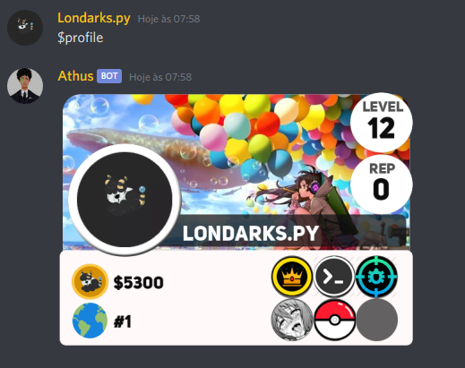

# Athus

<h1 align="center">
  
</h1>
<p align="center">Project Athus</p>
<p align="center">Bot para Discord</p>

<p align="center">
  <a href="https://opensource.org/licenses/MIT">
    
  </a>
</p>


### Requisitos
1. Python 3.8 ++

### :computer: Instalação
 
1. Clone o repositorio
2. instale as dependências ``` pip install -r requirements.txt  ```
3. Adicione seu Token no arquivo ```key.py```
4. Adicione no arquivo ```main.py```  o id do seu canal de boas vindas
5. Rode o bot com  ``` python or py main.py ```

## Sobre o Projeto

Projeto Athus naceu com o intuito de aprender usando python, e outras Bibliotecas,
o Projeto continurá sendo Atualizado e vocês poderam usar ele livrimente,caso queira participar do
projeto corrigindo Bugs **ou adicionando mais comandos**, Basta enviar um um Pull request que aceitarei com prazer

<h1 align="center">
  
</h1>

Ele foi criado principalmente para ser um bot Social ou seja tem bastantes comandos de passa tempo,
porem nem todos os comandos fora Adicionado Comandos até o Momento:

<table id="t01">
  <tr>
    <th>Comandos</th>
    <th>Descrição</th> 
    <th>Modo de usar</th>
  </tr>
  <tr>
    <td>$profile</td>
    <td>Para ver seu perfil no  bot</td>
    <td>$profile -- $profile @usuario </td>
  </tr>
  <tr>
    <td>$shop</td>
    <td>Para ver a loja do bot</td>
    <td>$shop</td>
  </tr>
  <tr>
    <td>$buybg</td>
    <td>Para comprar algum background da loja</td>
    <td>$buybg theme_0</td>
  </tr>
  <tr>
    <td>$buybgs</td>
    <td>Para comprar alguma badges da loja</td>
    <td>$buybg novice</td>
  </tr>
  <tr>
    <td>$setbg</td>
    <td>Para colocar uma background no perfil</td>
    <td>$setbg theme_0</td>
  </tr>
  <tr>
    <td>$setbds</td>
    <td>Para colocar um badges no perfil</td>
    <td>$setbg novice</td>
  </tr>
  <tr>
    <td>$inventory</td>
    <td>Para ver seu inventario</td>
    <td >$inventory</td>
  </tr>
  <tr>
    <td>$daily</td>
    <td>Para pegar a recompença diaria</td>
    <td >$daily</td>
  </tr>
  <tr>
    <td>$rep</td>
    <td>Para dar reputação para um menbro</td>
    <td >$rep @user</td>
  </tr>
  <tr>
    <td>$say</td>
    <td>Para fazer o bot dizer alguma coisa</td>
    <td >$say menssage</td>
  </tr>
  <tr>
    <td>$anime</td>
    <td>Para fazer o bot procurar um anime</td>
    <td >$anime konosuba</td>
  </tr>
  <tr>
    <td>$manga</td>
    <td>Para fazer o bot procurar um manga</td>
    <td >$manga konosuba</td>
  </tr>
  <tr>
    <td>$temporada</td>
    <td>O bot mostra todos os animes da temporada</td>
    <td >$temporada</td>
  </tr>
  <tr>
    <td>$Trump</td>
    <td>Escreve algo na pasta do trump</td>
    <td >$Trump menssagem</td>
  </tr>
  <tr>
    <td>$robin.</td>
    <td>Faz s o batman bater no robin por alguma besteira</td>
    <td >$robin menssagem</td>
  </tr>
</table>

## Autor
- **Londarks** - _Developer & Member of He4rt Developers_ - [Twitter](https://twitter.com/londarks)

## Colaboradores
- **KURONARU** - _Developer_ - [github](https://github.com/KURONARU96)

## Website
- **Website Athus** [Website](https://athusbot.github.io)
